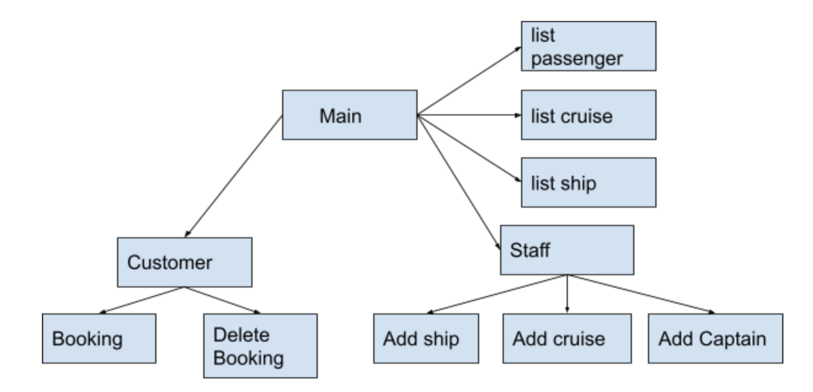

  

# cs166final
We built the cruise database and provide the web application interface for the user to manipulate it. It provides the service for customer and staff and can show the searhing result of the query

The introduction of the service we provide in each page:
* Booking: customer can add the cruise they want to book
* Delete Booking: customer can delete the cruise they had book
* Add ship: staff can add the new shipt to database
* Add cruise: staff can add the new cruise to database
* Add captain: staff can add the new captain to database
* list passenger: For a given Cruise and passenger status, return the number of passengers with the given status.

* list cruise: Given a Cruise number and a departure date, find the number of available seats in the Cruise.

## The rule of reservation status:
When customers add booking every time we check if there is a seat, and if there are extra seats, if not, set all the booking to ‘wait’ status. We will automatically check if there are new available seats for the customers in the same cruise, the definition here is strictly defined by us, all the number of reservations for a specific cruise id is smaller than the number of seats for that cruise, then it is available. As a result, we will change all of the customers in ‘W’ to ‘C’. Moreover, we provide the delete(cancel) booking for customers who make a reservation.

We also handle some problems of the number to prevent getting non-integer value or negative value.

We implement our web software application by Model–view–controller(MVC) model, the simple version, that is we treat the all the data entity to a Model.
